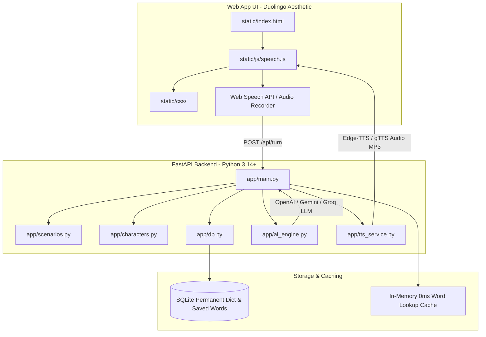
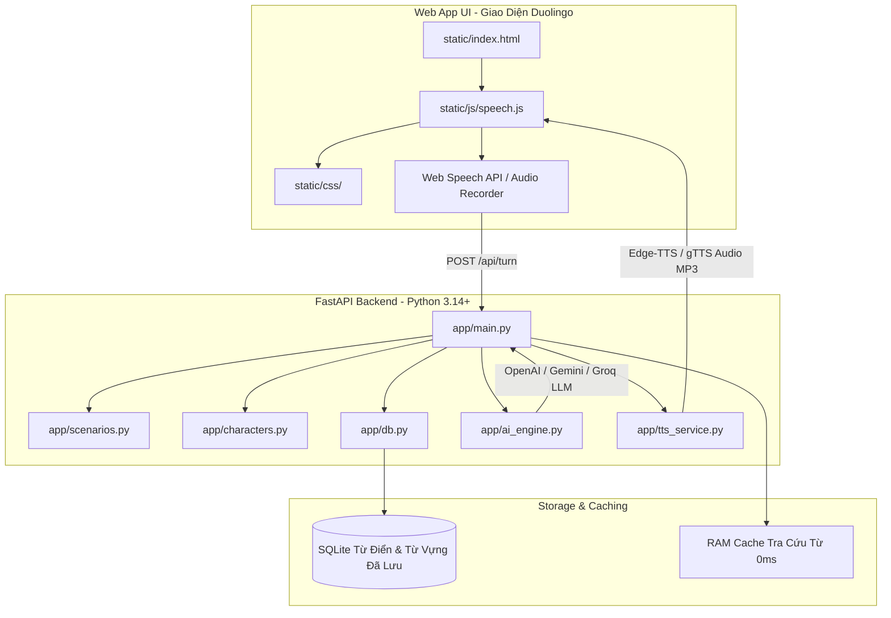

# 🏛️ docs/architecture.md — System Architecture & Live Code Mapping

This document describes the technical architecture, data flow, API contracts, and live code references for **Duolingo Speak**. All documentation points directly to active source files (*Tip 3: Point Docs at Live Code*).

---

## 1. High-Level System Architecture

---

## 2. Codebase Mapping & Module Boundaries (*Tip 3*)

| Component | Source File | Core Responsibilities & Live Functions |
| :--- | :--- | :--- |
| **API Entrypoint & Routes** | [`app/main.py`](file:///home/avandall1999/Projects/Doulingo_speak/app/main.py) | • Manages FastAPI app initialization and route definitions (`/api/scenarios`, `/api/custom_scenarios`, `/api/turn`, `/api/tts`, `/api/saved_words`). • Hosts `TRANSLATION_CACHE` and `IPA_CACHE` dictionaries for 0ms in-memory lookup (`app/main.py:L31-34`). |
| **AI Roleplay & Eval Engine** | [`app/ai_engine.py`](file:///home/avandall1999/Projects/Doulingo_speak/app/ai_engine.py) | • Manages `LEVEL_CONFIGS` (20 CEFR difficulty levels from Pre-A1 to C2 mastery, `app/ai_engine.py:L47`). • Dynamic Scenario Angle Randomizer (`SCENARIO_ANGLES`, `app/ai_engine.py:L27-35`). • LLM conversational response generation, Vietnamese translations, and pronunciation/grammar evaluation. |
| **Scenarios Catalog** | [`app/scenarios.py`](file:///home/avandall1999/Projects/Doulingo_speak/app/scenarios.py) | • Defines preset roleplay scenarios (`list_scenarios`, `get_scenario`). • Categorizes situations (Coffee Shop, Hotel Checkout, Job Interview, IELTS Exam practice). |
| **Characters Catalog** | [`app/characters.py`](file:///home/avandall1999/Projects/Doulingo_speak/app/characters.py) | • Defines AI conversational personas (`list_characters`, `get_character`), their personality traits, default CEFR tone, and TTS voice ID mapping. |
| **TTS Audio Generator** | [`app/tts_service.py`](file:///home/avandall1999/Projects/Doulingo_speak/app/tts_service.py) | • Generates neural speech audio (`generate_tts_mp3`) using `edge-tts` with fallback to `gTTS`. • Outputs streaming MP3 audio to frontend. |
| **Database & Permanent Store** | [`app/db.py`](file:///home/avandall1999/Projects/Doulingo_speak/app/db.py) | • Manages local SQLite storage for user custom scenarios (`add_custom_scenario`), saved vocabulary book (`save_translated_word`, `get_all_saved_words`), and dictionary lookups. |
| **Frontend PWA & Speech** | [`static/js/speech.js`](file:///home/avandall1999/Projects/Doulingo_speak/static/js/speech.js) | • Controls microphone input, Web Speech API speech-to-text recognition, UI state transitions, and audio playback. |
| **Frontend Shell & Styles** | [`static/index.html`](file:///home/avandall1999/Projects/Doulingo_speak/static/index.html) | • Single Page Application (SPA) layout incorporating Duolingo tokens (`#58CC02`), feather buttons, and responsive modals. |

---

## 3. Key Subsystem Specifications (*Tip 5: Feed Outside Knowledge*)

### 3.1 20-Level CEFR Difficulty System (`app/ai_engine.py`)
The system enforces strict constraints per level (Levels 1 to 20):
* **Word Count Constraints (`sentence_words`, `max_words`)**: Prevents LLM verbosity at beginner levels.
* **Grammar Whitelist (`grammar_allowed`)**: Limits tense usage (e.g., Present Simple only in Pre-A1; Subjunctive/Conditionals in C1-C2).
* **Vocabulary Tier (`vocab_tier`)**: Dynamically injects complexity instructions into LLM system prompts.

### 3.2 Instant 0ms Word Lookup & Cache Architecture
* **L1 Cache (In-Memory)**: Python dictionaries `TRANSLATION_CACHE` and `IPA_CACHE` in [`app/main.py`](file:///home/avandall1999/Projects/Doulingo_speak/app/main.py) provide sub-millisecond lookup for previously translated words.
* **L2 Cache (SQLite Storage)**: Permanent dictionary database managed by [`app/db.py`](file:///home/avandall1999/Projects/Doulingo_speak/app/db.py) (`get_translated_word`).
* **L3 Provider (LLM Engine)**: If a word is not cached in L1 or L2, [`app/ai_engine.py`](file:///home/avandall1999/Projects/Doulingo_speak/app/ai_engine.py) queries the LLM for context-aware Vietnamese translation and IPA transcription, then updates L1 and L2.

### 3.3 Audio Pipeline (STT -> LLM -> TTS)
1. **Speech Recognition**: User audio is recorded via browser Web Speech API or microphone stream in [`static/js/speech.js`](file:///home/avandall1999/Projects/Doulingo_speak/static/js/speech.js).
2. **API Turn Submission**: Transcript is sent to `POST /api/turn` with `scenario_id`, `character_id`, `user_transcript`, `conversation_history`, and `level`.
3. **Response Generation**: FastAPI invokes `ai_engine` for roleplay continuation and translation.
4. **TTS Speech Synthesis**: Audio MP3 generated via `edge-tts` in [`app/tts_service.py`](file:///home/avandall1999/Projects/Doulingo_speak/app/tts_service.py) is returned and auto-played in the browser.

---
---

# [VI] 🏛️ docs/architecture.md — Kiến Trúc Hệ Thống & Ánh Xạ Code Thực Tế

Tài liệu này mô tả kiến trúc kỹ thuật, luồng dữ liệu, hợp đồng API và các tham chiếu code thực tế của **Duolingo Speak**. Toàn bộ tài liệu trỏ trực tiếp đến các tập tin nguồn đang hoạt động (*Tip 3: Point Docs at Live Code*).

---

## 1. Kiến Trúc Hệ Thống Tổng Quan

---

## 2. Ánh Xạ Codebase & Ranh Giới Mô-đun (*Tip 3*)

| Thành Phần | Tập Tin Nguồn | Trách Nhiệm Cốt Lõi & Hàm Thực Tế |
| :--- | :--- | :--- |
| **API Entrypoint & Routes** | [`app/main.py`](file:///home/avandall1999/Projects/Doulingo_speak/app/main.py) | • Quản lý khởi tạo ứng dụng FastAPI và định nghĩa các route (`/api/scenarios`, `/api/custom_scenarios`, `/api/turn`, `/api/tts`, `/api/saved_words`). • Lưu trữ dictionary `TRANSLATION_CACHE` và `IPA_CACHE` để tra cứu nhanh 0ms trong bộ nhớ (`app/main.py:L31-34`). |
| **AI Roleplay & Eval Engine** | [`app/ai_engine.py`](file:///home/avandall1999/Projects/Doulingo_speak/app/ai_engine.py) | • Quản lý `LEVEL_CONFIGS` (20 cấp độ khó CEFR từ Pre-A1 đến thành thạo C2, `app/ai_engine.py:L47`). • Bộ ngẫu nhiên hóa góc độ kịch bản (`SCENARIO_ANGLES`, `app/ai_engine.py:L27-35`). • Tạo phản hồi hội thoại bằng LLM, dịch thuật tiếng Việt tự nhiên và đánh giá ngữ pháp/phát âm. |
| **Danh Mục Kịch Bản** | [`app/scenarios.py`](file:///home/avandall1999/Projects/Doulingo_speak/app/scenarios.py) | • Định nghĩa danh sách kịch bản nhập vai sẵn có (`list_scenarios`, `get_scenario`). • Phân loại tình huống (Quán Cà phê, Trả phòng Khách sạn, Phỏng vấn Xin việc, luyện thi IELTS). |
| **Danh Mục Nhân Vật** | [`app/characters.py`](file:///home/avandall1999/Projects/Doulingo_speak/app/characters.py) | • Định nghĩa tính cách nhân vật AI (`list_characters`, `get_character`), giọng điệu CEFR mặc định và ID giọng nói TTS. |
| **Bộ Tạo Âm Thanh TTS** | [`app/tts_service.py`](file:///home/avandall1999/Projects/Doulingo_speak/app/tts_service.py) | • Tạo âm thanh giọng nói truyền cảm (`generate_tts_mp3`) bằng `edge-tts` với cơ chế tự động chuyển sang `gTTS` khi cần. • Xuất âm thanh MP3 trực tiếp về frontend. |
| **Cơ Sở Dữ Liệu & Lưu Trữ** | [`app/db.py`](file:///home/avandall1999/Projects/Doulingo_speak/app/db.py) | • Quản lý CSDL SQLite cục bộ cho các kịch bản tùy chỉnh của người dùng (`add_custom_scenario`), sổ từ vựng (`save_translated_word`, `get_all_saved_words`) và tra cứu từ điển. |
| **Frontend PWA & Speech** | [`static/js/speech.js`](file:///home/avandall1999/Projects/Doulingo_speak/static/js/speech.js) | • Điều khiển microphone, chuyển đổi giọng nói thành văn bản bằng Web Speech API, quản lý trạng thái UI và phát âm thanh. |
| **Giao Diện Frontend & CSS** | [`static/index.html`](file:///home/avandall1999/Projects/Doulingo_speak/static/index.html) | • Bố cục Single Page Application (SPA) tích hợp các token Duolingo (`#58CC02`), nút bo góc 3D và các modal tương tác. |

---

## 3. Đặc Tả Các Hệ Thống Phụ (*Tip 5: Feed Outside Knowledge*)

### 3.1 Hệ Thống 20 Cấp Độ Khó CEFR (`app/ai_engine.py`)
Hệ thống thực thi các ràng buộc nghiêm ngặt theo từng cấp độ (từ Cấp 1 đến 20):
* **Giới Hạn Số Từ (`sentence_words`, `max_words`)**: Ngăn chặn LLM nói quá dài ở các cấp độ cơ bản.
* **Danh Sách Ngữ Pháp Được Phép (`grammar_allowed`)**: Giới hạn thì ngữ pháp sử dụng (ví dụ: chỉ dùng Thì Hiện Tại Đơn ở Pre-A1; Câu Điều Kiện/Giả Định ở C1-C2).
* **Cấp Độ Từ Vựng (`vocab_tier`)**: Đưa các hướng dẫn độ khó từ vựng vào hệ thống prompt của LLM một cách động.

### 3.2 Kiến Trúc Tra Cứu Từ 0ms & Bộ Nhớ Cache
* **L1 Cache (RAM Bộ Nhớ)**: Python dictionary `TRANSLATION_CACHE` và `IPA_CACHE` trong [`app/main.py`](file:///home/avandall1999/Projects/Doulingo_speak/app/main.py) cung cấp tốc độ tra cứu dưới 1 mili-giây cho các từ đã từng dịch.
* **L2 Cache (CSDL SQLite)**: Cơ sở dữ liệu từ điển vĩnh viễn được quản lý bởi [`app/db.py`](file:///home/avandall1999/Projects/Doulingo_speak/app/db.py) (`get_translated_word`).
* **L3 Provider (LLM Engine)**: Nếu từ chưa có trong L1 hoặc L2, [`app/ai_engine.py`](file:///home/avandall1999/Projects/Doulingo_speak/app/ai_engine.py) sẽ gọi LLM để dịch theo ngữ cảnh và tạo phiên âm IPA, sau đó tự động cập nhật L1 và L2.

### 3.3 Luồng Xử Lý Âm Thanh (STT -> LLM -> TTS)
1. **Nhận Diện Giọng Nói**: Giọng nói của người dùng được ghi âm qua Web Speech API trên trình duyệt trong [`static/js/speech.js`](file:///home/avandall1999/Projects/Doulingo_speak/static/js/speech.js).
2. **Gửi Lượt Hội Thoại**: Văn bản nhận diện được gửi qua `POST /api/turn` với `scenario_id`, `character_id`, `user_transcript`, `conversation_history` và `level`.
3. **Tạo Phản Hồi**: FastAPI gọi `ai_engine` để sinh câu trả lời nhập vai và bản dịch tiếng Việt.
4. **Tổng Hợp Giọng Nói TTS**: Âm thanh MP3 được tạo qua `edge-tts` trong [`app/tts_service.py`](file:///home/avandall1999/Projects/Doulingo_speak/app/tts_service.py) và tự động phát trên trình duyệt.
