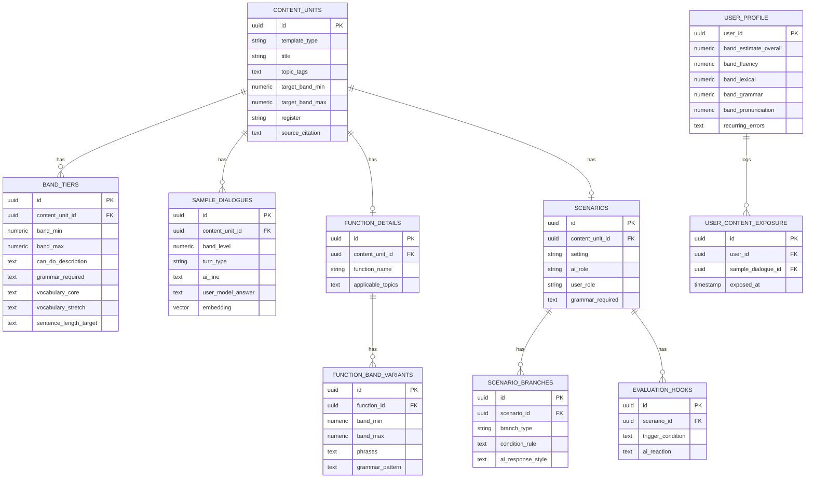

# Kiến trúc Backend & Kế hoạch Triển khai — AI Speaking Practice App

> Tài liệu này tổng hợp lại phần thiết kế hệ thống (workflow/backend), các ý tưởng cải tiến, và bổ sung một kế hoạch triển khai tổng thể theo từng giai đoạn để hiện thực hoá.

---

## 1. Nguyên tắc thiết kế cốt lõi

**Tách AI thành 2 vai trò riêng biệt:**

- **Conversational Agent (diễn viên)** — LLM chính, nhiệm vụ duy nhất là tạo ra câu nói tự nhiên, hấp dẫn, đúng ngữ cảnh. Không tự chấm điểm chính mình.
- **Scoring Agent (giám khảo âm thầm)** — hệ thống/model riêng, bám rubric cứng, chấm điểm dựa trên tín hiệu khách quan từ giọng nói và văn bản. Chạy song song, không lộ diện với user.

Lý do tách: nếu 1 AI vừa đóng vai người trò chuyện vừa tự đánh giá band của chính cuộc hội thoại nó tạo ra, kết quả sẽ thiên vị và không ổn định qua các lượt — mất đi tính khách quan cần có để đánh giá đúng năng lực user.

---

## 2. Pipeline xử lý 1 lượt hội thoại

```
[1] User nói (voice input)
        |
        v
[2] ASR + Scoring agent  ---->  ghi band mới  ---->  [DB]
    (ước lượng band real-time)                      Template DB +
        |                                            hồ sơ user
        v                                           (band, phrase bank,
[3] Retrieval layer (RAG)   <----  đọc để truy vấn  <---- lịch sử hội thoại)
    (lấy đúng đoạn theo band/topic)
        |
        v
[4] Prompt constructor
    (ghép profile + reference + rule)
        |
        v
[5] Conversational agent (LLM)
    (sinh câu tự nhiên, không script)
        |
        v
   ↻ quay lại bước [1] cho lượt hội thoại tiếp theo
```

### Chi tiết từng bước

**[1] User nói** — ASR xử lý song song theo chunk câu, không đợi user nói xong toàn bộ lượt mới bắt đầu xử lý, để giảm độ trễ cảm nhận.

**[2] ASR + Scoring agent** — đây là mảnh còn thiếu nhất so với 3 template dữ liệu tĩnh đã có. Đây **không phải LLM sinh văn bản**, mà là một model/rule-set nhỏ, nhanh, chấm dựa trên tín hiệu khách quan: độ dài câu, mật độ mệnh đề phụ, tốc độ nói, filler word, self-correction... rồi map ra band ước lượng. (Thiết kế chi tiết rubric này ở tài liệu riêng "Scoring Agent Design".)

**[3] Retrieval layer (RAG)** — Template DB (đã chuyển từ file `.md` tĩnh sang dạng có thể truy vấn, gắn metadata band/topic/function) trả về **2-4 đoạn liên quan nhất** cho lượt hiện tại — không nhét cả tài liệu vào prompt mỗi lần (tốn phí, loãng ngữ cảnh).

**[4] Prompt constructor** — ghép: hồ sơ user (band hiện tại theo từng kỹ năng, chủ đề đã dùng gần đây, lỗi ngữ pháp lặp lại) + đoạn tham khảo lấy được ở bước 3 + chỉ dẫn tường minh, ví dụ:

> "Đừng lặp nguyên văn phrase bank. Diễn đạt lại tự nhiên. Đặt đúng 1 câu hỏi tiếp theo phù hợp band X. Tránh các câu hỏi đã dùng trong 7 ngày qua."

**[5] Conversational agent** — LLM chính, output theo schema JSON có cấu trúc, không chỉ trả text tự do:

```json
{
  "ai_utterance": "...",
  "internal_band_signal": "rising | stable | struggling",
  "topic_tag": "accommodation",
  "difficulty_adjustment": "increase | hold | decrease"
}
```

`internal_band_signal` và `difficulty_adjustment` **không hiển thị cho user** — backend dùng để quyết định độ khó câu hỏi kế tiếp, tách biệt khỏi câu chữ AI thực sự nói ra (giữ hội thoại tự nhiên, không lộ cảm giác "đang bị chấm điểm").

### Cơ chế chống lặp / chống sáo rỗng

Trước khi trả câu hỏi về cho user: so sánh embedding của câu AI vừa sinh với N câu AI đã nói với user này trong 30 ngày gần nhất. Nếu độ tương đồng vượt ngưỡng, yêu cầu LLM sinh lại với chỉ dẫn "diễn đạt khác đi, tránh motif cũ".

---

## 3. Ý tưởng cải tiến để app khác biệt hơn "Duolingo-thường"

### 3.1 Ẩn điểm số real-time, chỉ show báo cáo định kỳ
Tách vai diễn viên/giám khảo (mục 1) nhưng đi xa hơn: giám khảo chấm ẩn danh, **không hiện điểm mỗi câu**, chỉ tổng hợp thành báo cáo tuần. Áp lực bị chấm điểm liên tục là lý do lớn khiến hội thoại luyện nói cảm giác như thi cử thay vì trò chuyện thật. Bỏ điểm số real-time khỏi trải nghiệm chính sẽ tăng hứng thú trả lời nhiều hơn bất kỳ cải tiến nội dung nào.

### 3.2 Persona AI nhất quán, có trí nhớ
Thay vì mỗi phiên là một cuộc phỏng vấn vô danh, cho AI một nhân vật cố định (tên, "tính cách", nhớ chuyện user từng kể) — giống cách Duolingo dùng các nhân vật cú Duo/Lily/Falcon. Ví dụ: "Lần trước bạn kể bị mất ví ở ga tàu, giờ tìm lại chưa?" — tạo cảm giác quan hệ liên tục, khác hẳn cảm giác máy hỏi bài lặp lại.

### 3.3 Chuyển khung từ "luyện thi" sang "mô phỏng đời thực"
Dùng đúng cấu trúc Template C (scenario + nhánh dễ/khó) nhưng đóng khung là tình huống sống thật (gọi Grab, phỏng vấn xin việc, tán gẫu quán cà phê) thay vì task card thi cử — nội dung ngôn ngữ tương đương nhưng động lực người dùng cao hơn nhiều vì thấy ứng dụng thực tế ngay lập tức.

### 3.4 Difficulty engine động thay vì band ladder tĩnh
Dùng thuật toán kiểu spaced-repetition / multi-armed-bandit để chọn độ khó câu hỏi tiếp theo, tối đa hoá vừa học vừa không nản — giống cách Duolingo điều chỉnh độ khó bài tập theo hiệu suất thực tế, thay vì đi theo đường thẳng band cố định. Band ladder trong Template A trở thành **item pool** cho thuật toán chọn, không phải lộ trình tuyến tính.

### 3.5 Sổ lỗi cá nhân dệt lại vào hội thoại mới
Nếu user hay mắc lỗi cụ thể (vd: quên "s" ngôi 3 số ít), thỉnh thoảng cài câu hỏi ở tình huống hoàn toàn khác nhưng buộc dùng đúng cấu trúc đó — ôn tập xen kẽ (interleaved practice) mà user không cảm thấy đang "ôn lỗi cũ" một cách lộ liễu.

### 3.6 Vòng lặp làm giàu dữ liệu (data flywheel)
Câu trả lời band cao nhất mà user thật sự tạo ra (không phải chép từ sách) được review rồi đưa ngược vào Template DB như ví dụ mới — giúp kho dữ liệu tự làm mới theo thời gian thay vì đóng băng ở nội dung ban đầu từ vài cuốn sách.

---

## 4. Kế hoạch triển khai tổng thể (đề xuất theo giai đoạn)

> Nguyên tắc chọn thứ tự: làm nền dữ liệu trước, sau đó pipeline tối giản chạy được (MVP) trước khi thêm engine thông minh, cuối cùng mới đến các tính năng khác biệt hoá.

### Giai đoạn 0 — Nền dữ liệu (2-4 tuần)
**Mục tiêu:** chuyển Template A/B/C từ file `.md` tĩnh sang dữ liệu truy vấn được.
- Thiết kế schema DB (bảng/collection cho topic, band_ladder, functional_bank, scenario, vocabulary_lookup)
- Chọn vector DB cho retrieval theo semantic (band + topic + function) — có thể kết hợp filter theo metadata cứng (band, topic_id) với semantic search cho phần "diversity_hint"/"hook_bank"
- Convert toàn bộ template đã điền (từ các cuốn sách) vào DB, gắn embedding
- Viết công cụ nội bộ (admin tool) để người điền liệu tiếp có thể nhập theo đúng schema, tránh lệch chuẩn giữa các cuốn sách khác nhau

**Output:** Template DB sống, truy vấn được qua API nội bộ.

### Giai đoạn 1 — MVP pipeline (4-6 tuần)
**Mục tiêu:** một lượt hội thoại chạy được end-to-end, chưa có scoring agent tinh vi.
- Tích hợp ASR (streaming, theo chunk câu)
- Retrieval layer đơn giản: lọc theo band tự khai báo (user tự chọn band khi onboarding) + topic đang chọn
- Prompt constructor bản v1 (chưa cá nhân hoá sâu, chỉ ghép band + topic + 2-3 đoạn tham khảo)
- Conversational agent trả JSON structured output (schema ở mục 2)
- TTS trả lời lại user

**Output:** app có thể trò chuyện được, band do user tự chọn (chưa đo tự động).

### Giai đoạn 2 — Scoring Agent & Adaptive Difficulty (4-8 tuần)
**Mục tiêu:** đo band tự động thay vì để user tự khai.
- Thiết kế rubric + pipeline map tín hiệu ASR → band (tài liệu riêng, xem phần tiếp theo của cuộc trò chuyện)
- Xây dựng hồ sơ user động: band ước lượng theo từng kỹ năng (fluency, lexical, grammar, pronunciation), cập nhật có làm mượt (smoothing) để tránh dao động band do 1 câu bất thường
- Thay retrieval "band tự chọn" bằng retrieval theo band ước lượng thực tế
- Thêm difficulty_adjustment signal vào vòng lặp retrieval

**Output:** hệ thống tự nhận diện band người dùng qua hội thoại, không cần bài test riêng.

### Giai đoạn 3 — Chống lặp, Persona, Trí nhớ (4-6 tuần)
**Mục tiêu:** hội thoại không còn cảm giác máy móc.
- Cơ chế chống lặp bằng embedding similarity (mục 2)
- Thiết kế persona cố định cho AI (tên, phong cách, "trí nhớ" về user)
- Bộ nhớ dài hạn: lưu tóm tắt các chủ đề/sự kiện user từng kể (không lưu toàn bộ transcript — tóm tắt theo entity để tiết kiệm & bảo mật)
- Ẩn điểm số real-time, chuyển sang báo cáo tuần

**Output:** trải nghiệm hội thoại gắn kết, không lặp lại, không cảm giác "app chấm điểm liên tục".

### Giai đoạn 4 — Mô phỏng đời thực & Ôn tập xen kẽ (6-8 tuần)
**Mục tiêu:** tăng động lực sử dụng dài hạn.
- Chuyển khung nội dung từ "luyện thi" sang tình huống đời thực (dựa trên Template C mở rộng)
- Sổ lỗi cá nhân (error journal) + cơ chế dệt lỗi cũ vào tình huống mới (interleaved practice)
- Difficulty engine nâng cấp lên dạng multi-armed-bandit/adaptive thực sự (không chỉ tăng/giảm 1 nấc)

**Output:** app cảm giác như một người bạn luyện nói thực tế, không chỉ công cụ ôn thi.

### Giai đoạn 5 — Data Flywheel (liên tục, sau khi có traffic ổn định)
**Mục tiêu:** dữ liệu tự làm giàu theo thời gian, giảm phụ thuộc vào sách nguồn ban đầu.
- Pipeline review câu trả lời band cao của user thật (human review hoặc AI review có kiểm định)
- Đưa các câu trả lời tốt vào lại Template DB như sample_dialogues mới
- Theo dõi chất lượng để tránh "suy thoái dữ liệu" (data drift) khi nội dung AI-generated dần thay thế nội dung gốc từ sách

**Output:** Template DB sống, tự cải thiện, không đóng băng ở nguồn ban đầu.

---

## 5. Bảng tóm tắt phụ thuộc & rủi ro chính

| Giai đoạn | Phụ thuộc vào | Rủi ro lớn nhất nếu bỏ qua thứ tự |
|---|---|---|
| 0 — Nền dữ liệu | Có sẵn template đã điền (A/B/C) | Không có nền, mọi retrieval sau này đều thủ công/không mở rộng được |
| 1 — MVP | Giai đoạn 0 xong | Nếu build scoring agent trước khi có pipeline chạy được, dễ tối ưu sai thứ (đo cái chưa dùng được) |
| 2 — Scoring agent | Giai đoạn 1 có dữ liệu hội thoại thật để hiệu chỉnh rubric | Rubric thiết kế trên giấy, không có dữ liệu thật để calibrate, dễ sai lệch band |
| 3 — Persona/chống lặp | Giai đoạn 2 (cần band ổn định trước khi cá nhân hoá sâu) | Cá nhân hoá dựa trên band chưa ổn định → trải nghiệm nhảy lung tung |
| 4 — Mô phỏng đời thực | Giai đoạn 3 (cần persona/trí nhớ làm nền) | Thiếu trí nhớ, tình huống đời thực sẽ vẫn cảm giác rời rạc như test |
| 5 — Data flywheel | Có traffic thật + giai đoạn 2 (để lọc câu trả lời "tốt" theo band chuẩn) | Đưa dữ liệu vào quá sớm khi chưa có cách kiểm định chất lượng → làm loãng/hỏng Template DB gốc |

---

## 6. Thiết kế Scoring Agent (rubric + map tín hiệu ASR → band)

### 6.1 Kiến trúc 2 tầng (bắt buộc vì lý do latency)

Chấm điểm chính xác (ngữ pháp, mạch lạc...) cần phân tích sâu — chạy nặng mỗi câu sẽ làm hội thoại giật, chờ lâu. Giải pháp: tách 2 tầng.

| Tầng | Chạy khi nào | Tốc độ | Việc gì |
|---|---|---|---|
| **Tầng 1 — Real-time scorer** | Mỗi lượt nói | dưới 300ms | Tín hiệu rẻ: tốc độ nói, độ dài câu, filler, độ đa dạng từ đơn giản → ra `difficulty_adjustment` ngay lập tức để câu hỏi tiếp theo không bị trễ |
| **Tầng 2 — Deep scorer (LLM-as-judge)** | Mỗi 5-10 lượt hoặc cuối phiên | 2-5s, chạy nền | Phân tích ngữ pháp, mạch lạc, phát âm sâu → cập nhật band chính thức trong hồ sơ user |

Tầng 1 quyết định độ khó câu hỏi *ngay*; Tầng 2 quyết định band *thật* hiển thị cho user (báo cáo tuần). Tách vậy để không phải đánh đổi giữa "phản hồi nhanh" và "chấm đúng".

### 6.2 Rubric — 4 trục, giữ tinh thần IELTS nhưng đo được tự động

**Trục 1: Fluency & Coherence (Trôi chảy & mạch lạc)**

| Tín hiệu | Cách đo | Nguồn dữ liệu |
|---|---|---|
| Tốc độ nói | Số từ/phút, tính từ ASR timestamp | Audio |
| Tỷ lệ khoảng lặng | Tổng thời gian pause > 0.5s / tổng thời gian nói | Audio (word-level timestamp) |
| Filler density | Đếm "umm/uh/well" trên 100 từ | Transcript |
| Self-correction | Regex phát hiện pattern "What I— I mean..." | Transcript |
| Dùng discourse marker | Đối chiếu với `functional_bank` (Template B) — có dùng "however/on the other hand/anyway" không | Transcript × Template DB |

**Trục 2: Lexical Resource (Vốn từ)**

| Tín hiệu | Cách đo |
|---|---|
| Đa dạng từ vựng | MTLD (Measure of Textual Lexical Diversity) — tốt hơn Type-Token Ratio thô vì không bị lệch theo độ dài câu |
| Độ hiếm của từ dùng | Tra rank tần suất từ (word frequency list, vd SUBTLEX) — dùng nhiều từ ngoài top 2000 từ phổ biến → band cao hơn |
| Khớp với `vocabulary_stretch` trong template | Đối chiếu trực tiếp: user có dùng đúng từ band cao của topic đang nói không |

**Trục 3: Grammatical Range & Accuracy (Ngữ pháp)**

| Tín hiệu | Cách đo |
|---|---|
| Độ phức tạp câu | Số mệnh đề phụ/câu qua dependency parser (spaCy) |
| Đa dạng cấu trúc | Có dùng conditional, passive, relative clause... không (pattern match nhẹ + parser) |
| Tỷ lệ lỗi | Chạy qua grammar checker (LanguageTool tự host, hoặc 1 LLM call nhẹ chuyên chấm lỗi) → lỗi/100 từ |

**Trục 4: Pronunciation (Phát âm)**

| Tín hiệu | Cách đo |
|---|---|
| Độ chính xác phoneme | Forced alignment + acoustic model chấm goodness-of-pronunciation (GOP score) — dùng Kaldi/Montreal Forced Aligner, hoặc API thương mại (Azure Pronunciation Assessment) nếu không muốn tự train |
| Trọng âm từ | So khớp vị trí trọng âm dự đoán vs thực tế nói (đúng nội dung sách hay dạy — compound adjective stress, linking...) |
| ASR confidence tự thân | Nếu ASR liên tục confidence thấp dù audio rõ, thường là dấu hiệu phát âm khó hiểu |

### 6.3 Công thức tổng hợp thành band

```
raw_score = 0.3×FC + 0.25×LR + 0.25×GRA + 0.2×PRON   (mỗi trục chuẩn hoá về thang 0-9)

band_hien_tai = EMA(band_cu, raw_score, alpha=0.2)
```

Dùng **exponential moving average (EMA)**, không lấy điểm câu vừa rồi làm band mới ngay — 1 câu bất thường (user mệt, nói vấp) không được kéo band rớt cả bậc. `alpha=0.2` nghĩa là band mới = 80% band cũ + 20% điểm lượt này — mượt nhưng vẫn phản ứng được sau vài lượt liên tiếp.

**Trọng số theo độ tin cậy**: nếu câu trả lời quá ngắn (dưới 5 từ) hoặc audio nhiễu, giảm alpha xuống gần 0 cho lượt đó — coi như "không đủ tín hiệu để cập nhật", tránh nhiễu làm lệch band.

### 6.4 Cold start — 3 lượt đầu tiên hiệu chỉnh nhanh

Thay vì để band trôi dần từ một giá trị mặc định, dùng 2-3 câu hỏi "diagnostic probe" đầu phiên đầu tiên (dùng đúng field `diagnostic_signals` đã đề xuất thêm vào template) — câu hỏi mở, trung tính chủ đề, để lấy mẫu ngôn ngữ đủ dài (>15 từ) ngay từ đầu, gán trọng số alpha cao hơn bình thường (0.5) cho 3 lượt này để hội tụ nhanh về band gần đúng, sau đó chuyển về alpha=0.2 cho các lượt sau.

### 6.5 Cần gì để hiệu chỉnh ngưỡng (bước hay bị bỏ qua)

Rubric trên chỉ đúng cấu trúc, còn ngưỡng số cụ thể (bao nhiêu từ/phút là band 6, MTLD bao nhiêu là band 7...) không thể đoán bằng lý thuyết — cần:
1. Bộ dữ liệu speech đã có band người thật chấm (có thể dùng corpus IELTS speaking mẫu công khai để khởi động ban đầu)
2. Chạy pipeline tính feature trên bộ đó, fit ngưỡng bằng regression đơn giản (không cần deep learning) map feature → band người chấm
3. Review định kỳ (mỗi tháng lấy mẫu ngẫu nhiên user thật, có người/AI review lại) để phát hiện model bị lệch (drift) khi user thực tế khác corpus gốc

### 6.6 Output schema mỗi lượt (nối vào pipeline ở mục 2)

```json
{
  "turn_score": {
    "fluency_coherence": 6.5,
    "lexical_resource": 6.0,
    "grammar_range_accuracy": 5.5,
    "pronunciation": 6.5,
    "confidence": 0.8
  },
  "updated_band_estimate": 6.2,
  "difficulty_adjustment": "hold"
}
```

### 6.7 Giới hạn cần lưu ý ngay từ đầu

- **Pronunciation scoring là phần đắt và khó nhất** — nếu ngân sách/thời gian hạn chế, nên MVP bỏ trục này hoặc dùng API thương mại có sẵn thay vì tự xây, rồi làm 3 trục còn lại trước (text-based, rẻ hơn nhiều).
- **LLM-as-judge (Tầng 2) không miễn phí về mặt thiên vị** — cùng 1 gia đình model đánh giá chính hội thoại nó tham gia tạo ra (dù là 2 lần gọi khác nhau) vẫn có rủi ro thiên vị nhẹ; nên định kỳ đối chiếu với review người thật, không tin tuyệt đối con số model tự chấm.
- **Cần audio, không chỉ transcript** — nếu pipeline chỉ lấy text từ ASR mà bỏ qua timestamp/audio gốc, sẽ mất toàn bộ trục Fluency và Pronunciation — đây là 2 trong 4 trục quan trọng nhất, nên cần đảm bảo backend giữ lại audio + word-level timestamp, không chỉ transcript thô.

---

## 7. Schema DB cho Template A/B/C (dạng truy vấn được)

### 7.1 Nguyên tắc thiết kế

Thay vì 3 bảng tách rời cứng theo A/B/C (dẫn đến 3 lần viết code retrieval khác nhau), gộp về **1 bảng cha `content_units`** dùng chung, phân biệt bằng `template_type`. Mỗi loại có bảng phụ riêng lưu field đặc thù. Bảng `sample_dialogues` là bảng trung tâm — nơi retrieval layer thực sự truy vấn nhiều nhất, dùng chung cho cả 3 loại template.

Dùng **Postgres + pgvector** (đơn giản, đủ dùng ở quy mô vừa) — kết hợp lọc cứng (band, topic) bằng SQL thường và tìm kiếm ngữ nghĩa (hook, diversity) bằng vector similarity trong cùng 1 câu query. Nếu sau này scale lớn, tách embedding sang vector DB riêng (Qdrant/Weaviate) vẫn theo đúng schema logic này.

### 7.2 Sơ đồ quan hệ (ERD)



### 7.3 Định nghĩa bảng chi tiết (DDL rút gọn, Postgres + pgvector)

```sql
-- Bảng cha, dùng chung cho cả 3 loại template
CREATE TABLE content_units (
  id UUID PRIMARY KEY DEFAULT gen_random_uuid(),
  template_type TEXT NOT NULL CHECK (template_type IN ('band_ladder','functional_bank','scenario')),
  title TEXT NOT NULL,
  topic_tags TEXT[] NOT NULL DEFAULT '{}',
  target_band_min NUMERIC(3,1),
  target_band_max NUMERIC(3,1),
  register TEXT,                       -- casual / neutral / formal
  source_citation TEXT,                -- vd: "Improve Your Skills IELTS 4.5-6.0, Unit 1"
  created_at TIMESTAMPTZ DEFAULT now(),
  updated_at TIMESTAMPTZ DEFAULT now(),
  version INT DEFAULT 1
);
CREATE INDEX idx_content_units_topic ON content_units USING GIN (topic_tags);
CREATE INDEX idx_content_units_band ON content_units (target_band_min, target_band_max);

-- Riêng cho Template A (và phần band ladder trong Template C)
CREATE TABLE band_tiers (
  id UUID PRIMARY KEY DEFAULT gen_random_uuid(),
  content_unit_id UUID REFERENCES content_units(id) ON DELETE CASCADE,
  band_min NUMERIC(3,1) NOT NULL,
  band_max NUMERIC(3,1) NOT NULL,
  can_do_description TEXT,
  grammar_required TEXT[],
  vocabulary_core TEXT[],
  vocabulary_stretch TEXT[],
  vocabulary_avoid TEXT[],
  sentence_length_target TEXT,
  common_errors_to_simulate TEXT
);
CREATE INDEX idx_band_tiers_range ON band_tiers (band_min, band_max);

-- Riêng cho Template B
CREATE TABLE function_details (
  id UUID PRIMARY KEY DEFAULT gen_random_uuid(),
  content_unit_id UUID UNIQUE REFERENCES content_units(id) ON DELETE CASCADE,
  function_name TEXT NOT NULL,
  applicable_topics TEXT[]
);

CREATE TABLE function_band_variants (
  id UUID PRIMARY KEY DEFAULT gen_random_uuid(),
  function_id UUID REFERENCES function_details(id) ON DELETE CASCADE,
  band_min NUMERIC(3,1) NOT NULL,
  band_max NUMERIC(3,1) NOT NULL,
  phrases TEXT[],
  grammar_pattern TEXT
);

-- Riêng cho Template C
CREATE TABLE scenarios (
  id UUID PRIMARY KEY DEFAULT gen_random_uuid(),
  content_unit_id UUID UNIQUE REFERENCES content_units(id) ON DELETE CASCADE,
  setting TEXT,
  ai_role TEXT,
  user_role TEXT,
  grammar_required TEXT[],
  vocabulary_core TEXT[],
  vocabulary_stretch TEXT[]
);

CREATE TABLE scenario_branches (
  id UUID PRIMARY KEY DEFAULT gen_random_uuid(),
  scenario_id UUID REFERENCES scenarios(id) ON DELETE CASCADE,
  branch_type TEXT CHECK (branch_type IN ('low_band','high_band')),
  condition_rule TEXT,
  ai_response_style TEXT,
  example_text TEXT
);

CREATE TABLE evaluation_hooks (
  id UUID PRIMARY KEY DEFAULT gen_random_uuid(),
  scenario_id UUID REFERENCES scenarios(id) ON DELETE CASCADE,
  trigger_condition TEXT,
  ai_reaction TEXT
);

-- Bảng trung tâm — nơi retrieval layer query nhiều nhất, dùng chung cho A/B/C
CREATE TABLE sample_dialogues (
  id UUID PRIMARY KEY DEFAULT gen_random_uuid(),
  content_unit_id UUID REFERENCES content_units(id) ON DELETE CASCADE,
  band_level NUMERIC(3,1) NOT NULL,
  turn_type TEXT,                      -- opening / elaborate / negotiation / closing / standalone
  function_tag TEXT,                   -- chỉ dùng khi content_unit là functional_bank
  ai_line TEXT NOT NULL,
  user_model_answer TEXT NOT NULL,
  embedding VECTOR(1536),              -- embed(ai_line + user_model_answer + topic_tags)
  created_at TIMESTAMPTZ DEFAULT now()
);
CREATE INDEX idx_sample_dialogues_band ON sample_dialogues (band_level);
CREATE INDEX idx_sample_dialogues_embedding ON sample_dialogues
  USING hnsw (embedding vector_cosine_ops);

-- Ngân hàng hook / anti-cliche (phụ lục trong template gốc)
CREATE TABLE hook_bank (
  id UUID PRIMARY KEY DEFAULT gen_random_uuid(),
  topic_tags TEXT[],                   -- NULL = dùng chung mọi topic
  text TEXT NOT NULL,
  type TEXT CHECK (type IN ('hook','anti_cliche'))
);

-- Ngân hàng từ vựng tra nhanh (phụ lục vocabulary_lookup_bank)
CREATE TABLE vocabulary_lookup (
  id UUID PRIMARY KEY DEFAULT gen_random_uuid(),
  category TEXT NOT NULL,              -- vd: accommodation, personality_for_jobs
  tier TEXT,                           -- neutral / descriptive / positive / negative...
  terms TEXT[]
);

-- Hồ sơ user (runtime, không phải nội dung template nhưng cần để retrieval cá nhân hoá)
CREATE TABLE user_profile (
  user_id UUID PRIMARY KEY,
  band_estimate_overall NUMERIC(3,1),
  band_fluency NUMERIC(3,1),
  band_lexical NUMERIC(3,1),
  band_grammar NUMERIC(3,1),
  band_pronunciation NUMERIC(3,1),
  recurring_errors JSONB DEFAULT '[]',
  updated_at TIMESTAMPTZ DEFAULT now()
);

-- Log chống lặp — nền cho cơ chế anti-repetition ở mục 2
CREATE TABLE user_content_exposure (
  id UUID PRIMARY KEY DEFAULT gen_random_uuid(),
  user_id UUID REFERENCES user_profile(user_id),
  sample_dialogue_id UUID REFERENCES sample_dialogues(id),
  exposed_at TIMESTAMPTZ DEFAULT now()
);
CREATE INDEX idx_exposure_user_time ON user_content_exposure (user_id, exposed_at);
```

### 7.4 Câu query mẫu — đúng việc retrieval layer (mục 2, bước [3]) sẽ chạy mỗi lượt

```sql
-- Lấy 4 sample_dialogues phù hợp nhất: đúng topic, đúng vùng band hiện tại,
-- chưa show cho user này trong 30 ngày qua, ưu tiên gần band nhất và gần nghĩa nhất
SELECT sd.id, sd.ai_line, sd.user_model_answer, sd.band_level
FROM sample_dialogues sd
JOIN content_units cu ON sd.content_unit_id = cu.id
WHERE cu.topic_tags && ARRAY['accommodation']
  AND sd.band_level BETWEEN :band_estimate - 0.5 AND :band_estimate + 1.0
  AND sd.id NOT IN (
    SELECT sample_dialogue_id FROM user_content_exposure
    WHERE user_id = :user_id AND exposed_at > now() - interval '30 days'
  )
ORDER BY sd.embedding <-> :query_embedding
LIMIT 4;
```

Query này gói gọn đúng 3 việc retrieval layer cần làm: **lọc cứng theo topic + band** (SQL thường, rẻ) → **loại nội dung đã dùng gần đây** (chống lặp, mục 3 phần chống sáo rỗng) → **xếp hạng theo độ liên quan ngữ nghĩa** (vector search, cho phần "diversity_hint"/"hook"). Đây chính là câu query mà bước `[3] Retrieval layer` ở pipeline mục 2 sẽ gọi mỗi lượt hội thoại.

### 7.5 Lưu ý khi migrate từ file `.md` sang schema này

- Mỗi file Template A đã điền (vd `A-accommodation-001`) → 1 row `content_units` (template_type='band_ladder') + N row `band_tiers` (mỗi band 1 row) + N row `sample_dialogues`.
- File Template B gộp nhiều function → mỗi function trong file là 1 `content_units` riêng (template_type='functional_bank') + `function_details` + `function_band_variants`, không gộp chung 1 row cho cả file.
- File Template C → 1 `content_units` (template_type='scenario') + 1 `scenarios` + N `scenario_branches` + N `evaluation_hooks` + N `sample_dialogues`.
- `vocabulary_lookup_bank` và `hook_bank` trong phụ lục tách thành 2 bảng độc lập, không gắn `content_unit_id` — vì chúng dùng chung xuyên suốt, không thuộc riêng 1 template nào.